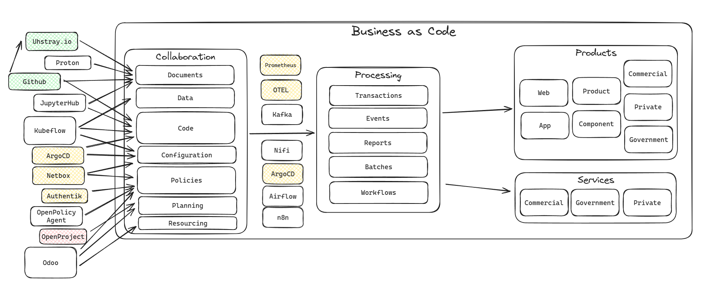

# business-as-code
Artifacts, documentation, and automation to develop a cloud-native IT business

## Business as Code Roles and MVP Goals

Business as Code is a series of artifacts, documentation, and automation to develop a cloud-native IT business. The initial targeted roles and goals are as follows:

## Business as Code Foundational Technologies (WIP)

The foundational technologies for Business as Code are as follows:

