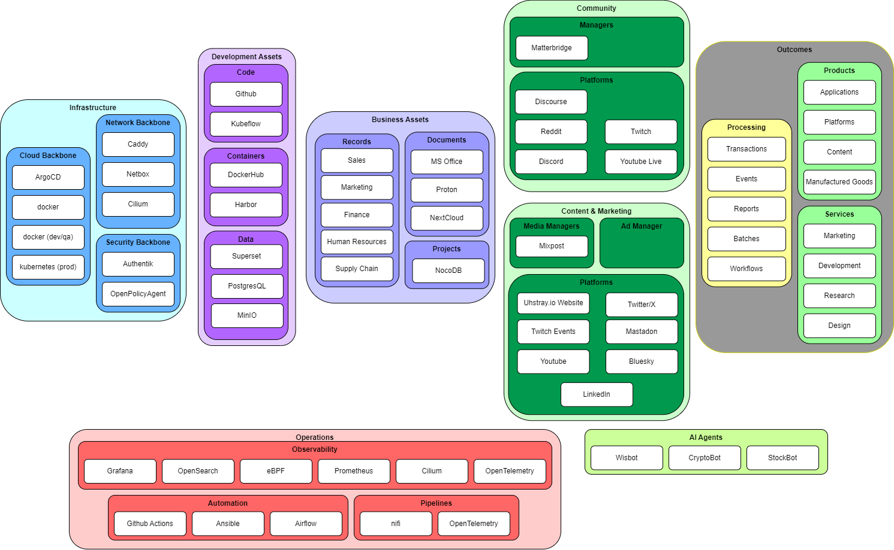

# business-as-code
Privacy focused Open-source AI, Platforms and Automation for startups and small business. Customizable, scalable, extensible, and performant!

### Business as Code Foundational Repositories
   - [autobox - infrastructure backbone](https://github.com/uhstray-io/autobox)
   - [Wisbot - search, event, and llm orchestrator](https://github.com/uhstray-io/wisbot)
   - [WisLLM - ai & ml orchestrator](https://github.com/uhstray-io/WisLLM) - WIP
   - [data-warehouse - data warehousing for business-as-code](https://github.com/uhstray-io/data-warehouse)
   - [community](https://github.com/uhstray-io/community) - (Coming Soon)
   - [content](https://github.com/uhstray-io/content) - (Coming Soon)
   - [o11y - uhstray.io full-stack observability](https://github.com/uhstray-io/o11y)
   - [workstations - developer device management & setup](https://github.com/uhstray-io/workstations)

## Business as Code Roles and MVP Goals

Business as Code is a series of artifacts, documentation, and automation to develop a cloud-native IT business. The initial targeted roles and goals are as follows:

## Contributing Guidelines

- [Review our Code of Conduct](https://www.uhstray.io/en/code-of-conduct)
- [Check our CONTRIBUTING.MD](./CONTRIBUTING.md)

## Business as Code Foundational Technologies (WIP)

The foundational technologies for Business as Code are as follows:

### DevOps Labeling & Resource Strategy

