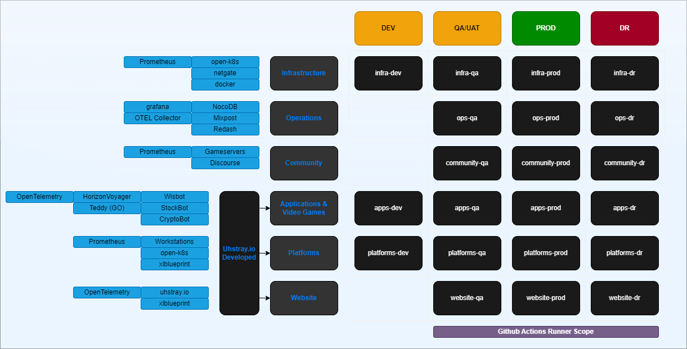

# business-as-code
Artifacts, documentation, and automation to develop a cloud-native IT business

## Business as Code Roles and MVP Goals

Business as Code is a series of artifacts, documentation, and automation to develop a cloud-native IT business. The initial targeted roles and goals are as follows:

## Contributing Guidelines

- [Review our Code of Conduct](https://www.uhstray.io/en/code-of-conduct)
- [Check our CONTRIBUTING.MD](./CONTRIBUTING.md)

## Business as Code Foundational Technologies (WIP)

The foundational technologies for Business as Code are as follows:

### DevOps Labeling & Resource Strategy

### Business as Code Foundational Repositories
   - [cloud backbone](https://github.com/uhstray-io/cloud-backbone)
   - [network backbone](https://github.com/uhstray-io/network-backbone)
   - [security backbone](https://github.com/uhstray-io/security-backbone)
   - [ai & ml](https://github.com/uhstray-io/ai)
   - [community](https://github.com/uhstray-io/community)
   - [content](https://github.com/uhstray-io/content)
   - [observability](https://github.com/uhstray-io/o11y)
   - [pipelines](https://github.com/uhstray-io/pipelines)
   - [wisbot](https://github.com/uhstray-io/wisbot)
