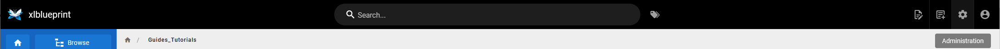
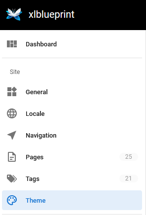
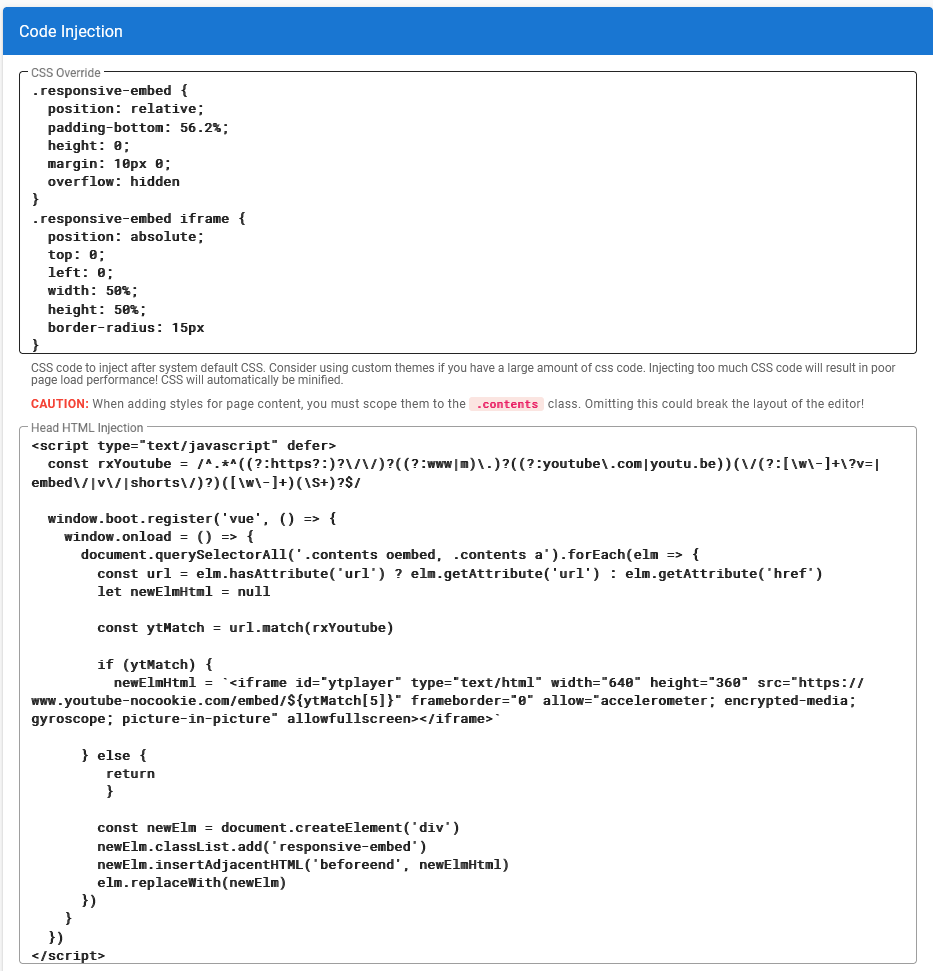
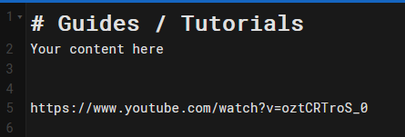
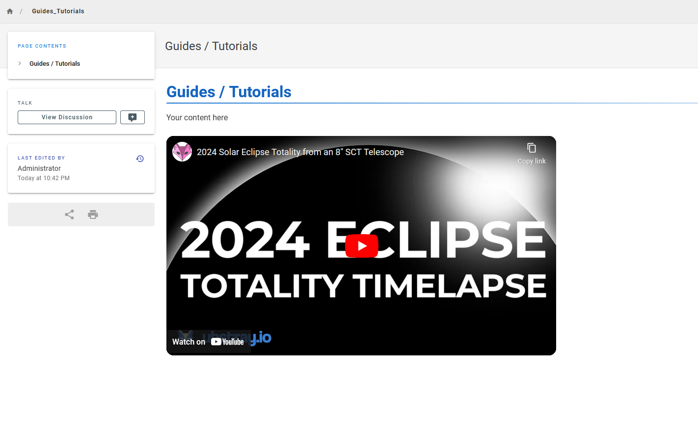

# Setup your Wiki.js Site

Docker create command for Wiki.js with SSL configuration

```bash
docker create --name=wiki -e LETSENCRYPT_DOMAIN=wiki.example.com -e LETSENCRYPT_EMAIL=email@example.com -e SSL_ACTIVE=1 -e DB_TYPE=postgres -e DB_HOST=db -e DB_PORT=5432 -e DB_PASS_FILE=/etc/wiki/.db-secret -v /etc/wiki/.db-secret:/etc/wiki/.db-secret:ro -e DB_USER=wiki -e DB_NAME=wiki -e UPGRADE_COMPANION=1 --restart=unless-stopped -h wiki --network=wikinet -p 80:3000 -p 443:3443 requarks/wiki:2
```

# Enable youtube videos to be embeded on your Wiki.js Site
- [Article and source material](https://github.com/requarks/wiki/discussions/4580) 

1. Log in in as an admin to your wikijs site

    

2. Select Theme from the admin panel

    

3. Add code to "CSS OVERRIDE" and "Head HTML Injection" Sections

    

4. Add youtube link to your wiki page

    

5. Embeded youtube video

    
